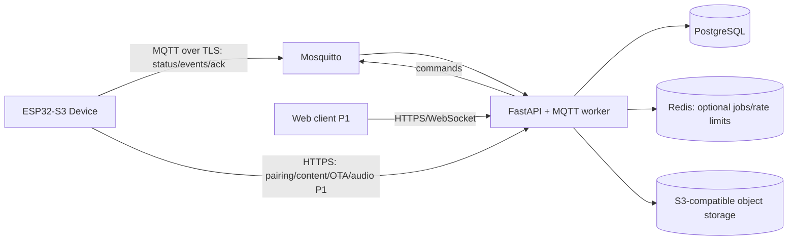

# 02 — 系统架构规范

**状态：Accepted**

## 1. 总体架构

设备保持本地优先：触摸动作先改变本地状态并写入 outbox，网络同步异步完成。后端是账户、设备绑定、内容版本和学习记录的权威源；设备是未同步本地动作的临时权威源。

## 2. 技术选型

| 层 | 选择 | 说明 |
| --- | --- | --- |
| 固件 | ESP-IDF、C/C++、LVGL | 使用目标板 BSP；版本在首次可编译 vertical slice 后锁定 |
| API | Python 3.12、FastAPI、Pydantic | REST/OpenAPI 与异步 I/O |
| 数据库 | PostgreSQL | 设备、内容元数据、学习事件与聚合状态 |
| 消息 | Eclipse Mosquitto，MQTT 5 优先 | 设备控制面；若 BSP 客户端只稳定支持 3.1.1，保持 payload 契约不变 |
| 对象 | S3-compatible storage | 内容包、OTA image 和 P1 语音片段 |
| 本地开发 | Docker Compose | 后端、数据库、broker、对象存储的一键环境 |

生产依赖必须固定版本或 digest，不能使用 `latest`。

## 3. 组件边界

### 固件组件

- `bsp`：LCD、touch、audio、IMU、SD、背光和电源；
- `platform`：Wi-Fi、时间、NVS、文件系统、OTA、诊断；
- `connectivity`：配网、HTTPS、MQTT、重连和 outbox；
- `domain`：卡片 session、动作、内容索引和提醒规则；
- `ui`：页面、组件、主题、动画和 UI state adapter；
- `app`：生命周期与组件装配，不容纳驱动细节。

### 后端组件

- `api`：HTTP endpoints、鉴权、schema 转换；
- `domain/services`：配对、内容发布、学习事件和命令状态；
- `repositories`：PostgreSQL 访问；
- `mqtt`：订阅、校验、领域分发、发布和 ack 追踪；
- `workers`：内容构建、通知和 P1 AI job；
- `observability`：结构化日志、metrics、tracing。

## 4. 核心数据模型

| 实体 | 关键字段 |
| --- | --- |
| Device | id, name, firmware_version, credential_version, last_seen_at |
| PairingSession | code_hash, expires_at, claimed_at, device_id |
| ContentBundle | id, version, manifest_url, sha256, size_bytes, status |
| Card | id, bundle_id, type, front, back, assets |
| StudyEvent | message_id, device_id, card_id, action, occurred_at, received_at |
| CardProgress | device_id, card_id, difficulty, last_seen_at, revision |
| DeviceCommand | message_id, device_id, type, payload, expires_at, status |

> ADR-008：MVP 不引入 `User` 实体。数据归属直接挂在 `Device` 上（单设备 / 单用户场景）；主程序对接与多用户共享设备列为 P1+，届时再补账户层与归属迁移。

`StudyEvent.message_id` 唯一，用于 QoS 1 去重。`CardProgress` 是事件投影，不能替代原始事件审计。

## 5. 关键数据流

### 学习动作

1. UI 产生领域 action；
2. 固件更新本地 session 并将 envelope 写入 outbox；
3. connectivity 发布 QoS 1 event；
4. 后端按 `message_id` 幂等落库并更新 projection；
5. 后端发布业务 ack；
6. 设备收到 ack 后从 outbox 删除。

MQTT 的 PUBACK 只表示 broker 收到，不能替代业务 ack。

### 内容发布

1. 后端创建 immutable bundle 和 manifest；
2. 发布 `content.sync` 命令，包含 HTTPS URL、版本、大小与 SHA-256；
3. 设备下载到临时文件并逐块校验；
4. 校验通过后原子替换 active pointer；
5. 设备 ack 成功并异步回收旧包；失败则保留旧包。

### OTA

固件只接受签名/可信 HTTPS 来源的 image；写入非活动 OTA 分区，校验后切换。新固件在完成基础自检和网络初始化后标记有效，否则由 bootloader 回滚。

## 6. 安全边界

- `local` 开发环境：broker `allow_anonymous`、无 topic ACL、REST 全开放（ADR-008），仅靠网络隔离；
- `staging/production`：每设备独立客户端证书或等价的短期凭据；broker ACL 限制设备只能访问自身 `foxsay/v1/devices/{device_id}/...`；
- 配对码只保存哈希、短时有效、限制尝试次数；
- 下载 URL 短时签名，manifest 同时携带内容哈希；
- 语音默认不持久保存；如业务需要保留，必须取得同意并设置自动删除期限；
- NVS 凭据使用目标芯片支持的安全存储方案，量产启用 Secure Boot 与 Flash Encryption 前须完成烧录流程演练。

## 7. 部署环境

- `local`：Compose，假数据和开发凭据；
- `staging`：TLS、真实设备、隔离数据库，用于 OTA 与兼容性验证；
- `production`：独立秘密、备份、监控和 broker ACL。

数据库 migration 必须可前滚；固件发布采用 staged rollout（内部设备 → 小批量 → 全量），不能一次推送全部设备。
