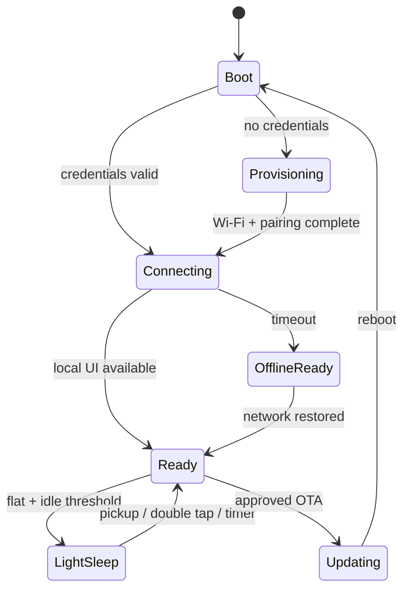

# 03 — 设备固件规范

**状态：Accepted**
**目标硬件：立创·实战派 ESP32-S3 N16R8 原型板**

硬件基线为 16 MB Flash、8 MB PSRAM、320×240 电容触摸屏、QMI8658 姿态传感器、ES7210 音频输入、ES8311 音频输出和 SD 卡。LCD/触控的具体控制器与坐标旋转仍以 Phase 0 真机探针为准。

## 1. 运行模型

| 执行单元 | 职责 | 禁止事项 |
| --- | --- | --- |
| UI task | LVGL tick、输入分发、页面渲染 | 网络、SD、NVS、音频阻塞 I/O |
| app/domain task | 状态机、session、命令协调 | 直接调用 LVGL |
| connectivity task | Wi-Fi、MQTT 生命周期、outbox | 修改页面对象 |
| storage worker | bundle、资源读取、校验 | 长时间持有 UI 资源锁 |
| sensor task | IMU 采样、滤波、姿态事件 | 每个采样点写 NVS/日志 |
| audio task（P1） | I2S、编码、ring buffer | 无界缓存 |

任务间通过有界 queue/event group 传递小消息。大资源用句柄或所有权转移，避免复制整帧图片/音频。

## 2. 顶层状态机

- `Ready` 不依赖 MQTT 在线；网络状态是正交状态；
- 进入休眠前 flush 文件系统元数据，但不得等待服务端；
- OTA 不在电量/供电不足、学习 session 活跃或下载未校验时开始。

## 3. 启动与自检

`FW-BOOT-01` 启动依次初始化 NVS、诊断、显示/触摸、存储、领域状态、Wi-Fi/MQTT；显示应尽早出现，不等待网络。

`FW-BOOT-02` 自检记录 reset reason、当前/最小 heap、PSRAM、active OTA slot、SD 状态、内容版本和外设错误码。

`FW-BOOT-03` SD 缺失或损坏时进入降级模式，至少保留主屏、内置最小字体、配网和诊断；不能 boot loop。

## 4. UI 与手势契约

全局颜色沿用原始设计：背景 `#151311`、主色 `#F59E0B`、文字 `#FFF7ED`、弱化文字 `#BFAFA6`。最终资源必须在真实 320×240 屏幕验证，生成样机不是像素级实现依据。

### 事件优先级

1. 系统阻断层（OTA/关键错误/健康提醒）；
2. 顶边 20 px 起始的下拉快捷面板；
3. 已打开的 modal/overlay；
4. 页面专属手势；
5. 页面间导航。

识别出高优先级手势后必须消费事件，不能继续触发卡片切换。滑动判定以起点、主方向、距离和速度共同决定；阈值放入配置并通过真机校准，不散落 magic number。

### P0 页面行为

| 页面 | Tap | Swipe up | Swipe down | Swipe left/right |
| --- | --- | --- | --- | --- |
| 主屏 | 双击唤醒/亮屏 | 打开计时设置（P1） | 顶边起始打开快捷面板 | 切换主页面（仅非卡片区） |
| 单词卡 | 下一张 | 无 | 顶边起始打开快捷面板 | 无，避免误操作 |
| 公式卡 | 翻面 | 标记难点并下一张 | 下一张 | 无 |
| 休眠屏 | 双击唤醒 | 无 | 无 | 无 |

原始文档中“Wiki 左右滑方向”存在认知歧义。P1 统一为：卡片向右移动 = 保存，向左移动 = 忽略；层级导航不与划卡页面共用。

`FW-UI-01` 最小可点击目标建议 44×44 px；例外是全屏手势。
`FW-UI-02` 常规正文不小于 14 px，辅助信息不小于 12 px，并在真机做可读性验证。
`FW-UI-03` 网络动作采用 optimistic feedback；失败以非阻断状态提示，不回滚已经完成的翻卡动画。
`FW-UI-04` 动画支持低资源降级；内存不足时优先保内容与输入，不因装饰动画崩溃。

## 5. 本地数据与 outbox

- NVS：设备配置、凭据引用、音量、时区、active bundle pointer、少量状态；
- Flash data partition：诊断和小型回退资源；
- SD：版本化内容包、字体、动画、P1 音频临时片段；
- outbox：追加式、有 CRC、容量上限、ack 后回收；断电后可恢复。

`FW-DATA-01` outbox 达到 80% 时记录告警；满时优先保留学习变更，合并可覆盖的 status，UI 明确提示同步受阻。
`FW-DATA-02` 内容包结构包含 `manifest.json`、cards、fonts/assets；路径不可逃逸 bundle 根目录。
`FW-DATA-03` 写 active pointer 必须原子化，启动时能在新旧 bundle 中选择最后一个完整版本。

## 6. 网络行为

`FW-NET-01` Wi-Fi/MQTT 使用指数退避加随机抖动，网络恢复后不要瞬时重发全部消息。
`FW-NET-02` MQTT 设置 LWT，设备定期发布 retained presence；服务端以 `last_seen` 判断陈旧状态。
`FW-NET-03` 命令校验 `schema_version`、`device_id`、`expires_at` 和 payload；过期或未知命令返回拒绝 ack。
`FW-NET-04` 最近处理的 command `message_id` 有界持久化，重投不重复执行。
`FW-NET-05` 设备时间未同步时允许本地动作，用 monotonic 顺序和 `clock_synced=false` 标记，联网后不伪造时间。

## 7. 资源预算与门槛

首次 vertical slice 要输出真实 map/heap 数据，再锁定预算。MVP 暂定门槛：

- app image 单槽不超过分区的 80%；
- 稳态内部 heap 保留至少 64 KiB，最大业务场景下不得持续下降；
- PSRAM 留出至少 20% 突发余量；
- LVGL 使用局部 draw buffer，不默认分配全屏双缓冲；
- 单个 MQTT payload 上限 16 KiB，内容和资源只传 URL；
- outbox 默认上限 1 MiB 或 10,000 事件，取先到者。

分区表必须由实测固件尺寸和 ESP-IDF OTA 要求生成。原资料中的示例 offset/size 未验证，不能直接用于生产。

## 8. 固件验收测试

- 100 次冷启动/断电恢复；
- Wi-Fi 错密、broker 不可达、频繁断线和重连风暴；
- 10,000 条离线事件写入、重启、恢复上传与去重；
- 内容下载中断、哈希错误、SD 拔出、切换时断电；
- 8 小时 UI/网络 soak，记录 heap watermark 和 FPS；
- 30 轮每种手势与姿态场景，记录误触/误判；
- OTA 成功、image 损坏和新版本未确认三类回滚。

## 9. 硬件参考

- [立创·实战派 ESP32-S3 官方介绍](https://wiki.lckfb.com/zh-hans/szpi-esp32s3/beginner/introduction.html)
- [官方 LCD 示例与 320×240 配置说明](https://wiki.lckfb.com/zh-hans/szpi-esp32s3/beginner/lcd-display.html)
- [官方 SD 卡（1-bit SDIO）说明](https://wiki.lckfb.com/zh-hans/szpi-esp32s3/beginner/sd-card.html)

官方教程用于确认原型板能力；生产实现仍以仓库锁定的板卡版本、原理图和真机测试结果为准。
