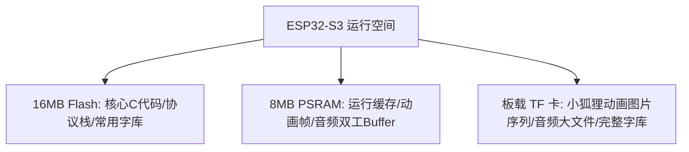
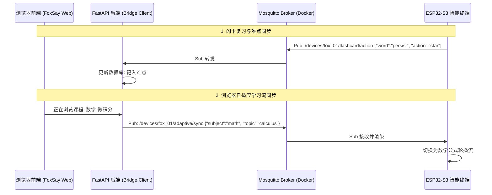

# FoxSay 固件空间优化与 WiFi+MQTT 后端通信架构设计

为了保证 FoxSay 桌面智能终端能够稳定运行在 **【立创·实战派 ESP32-S3】**（16MB Flash + 8MB PSRAM）上，并实现与 FastAPI 后端的低耦合、高可靠交互，本方案从**固件空间优化**与**通信协议设计**两个维度提供完整的系统架构。

---

## 💾 维度一：有限固件空间优化方案

虽然 16MB Flash 空间相对充足，但 **中文字库**（汉字字模）和 **小狐狸多帧动画/音轨** 是空间杀手。我们需要通过“动静分离”和“按需加载”来控制固件体积。

### 1. 内存与存储划分（Flash/PSRAM/TF卡 预算表）
*   **Flash (16MB)**: 仅存放基础代码、Wi-Fi/MQTT协议栈、LVGL核心库、基本英文与常用汉字字模。
*   **PSRAM (8MB)**: 存放动态分配的 LVGL 缓冲区、TF卡加载的狐狸动画位图帧、MQTT接收缓存、以及双工音频录制环形缓冲区 (Ring Buffer)。
*   **板载 TF 卡 (SPI/SDIO 模式，无上限容量)**: 存放重型静态资源（如 MP3 提示音、狐狸序列帧图片、大字号中文全部字库二进制文件、本地离线缓存单词库）。



### 2. 动态字库渲染与字库子集化 (Font Subsetting)
*   **方案 A (静态字库精简)**: 仅将 UI 界面写死的字（如“微积分”、“记难点”、“已休眠”）以及常用的 3500 个一级常用汉字用 LVGL Font Tool 转成 C 数组打包进 Flash，体积可控制在 300KB 左右。
*   **方案 B (TF卡动态字库)**: 将包含全部汉字的 `SourceHanSans.bin` (约 3-4MB) 存放在 TF 卡中。LVGL 通过 **文件系统字库引擎 (FreeType / Bin Font loader)**，在渲染文字时实时从 TF 卡中检索并加载对应的字符点阵至 PSRAM 中。

### 3. 自定义分区表优化 (`partitions.csv`)
默认的 2MB App 分区不足以进行 OTA 升级。我们定制一个 16MB Flash 的分区表：
```csv
# Name,   Type, SubType, Offset,  Size, Flags
nvs,      data, nvs,     0x9000,  0x4000,
otadata,  data, ota,     0xd000,  0x2000,
phy_init, data, phy,     0xf000,  0x1000,
factory,  app,  factory, 0x10000, 0x400000,  # 4MB 主App分区
ota_0,    app,  ota_0,   ,        0x400000,  # 4MB OTA备份分区
storage,  data, fat,     ,        0x7E0000,  # 残余空间作为本地配置文件存储 (约7.8MB)
```

---

## 🌐 维度二：基于 WiFi + MQTT 的后端交互架构

通过 MQTT 轻量级发布/订阅机制，设备端与后端的 FastAPI 服务完全解耦，外设仅作为“无状态的传感器输入与显示输出终端”。



### 1. 后端新增 MQTT Docker 容器配置
在您项目根目录的 `docker-compose.yml` 或专门的开发配置中，部署 `Eclipse-Mosquitto` 消息代理：

```yaml
version: '3.8'
services:
  mqtt-broker:
    image: eclipse-mosquitto:latest
    container_name: foxsay-mqtt-broker
    ports:
      - "1883:1883"      # TCP 通信端口
      - "9001:9001"      # WebSocket 通信端口 (便于网页端调试)
    volumes:
      - ./infra/mqtt/config:/mosquitto/config
      - ./infra/mqtt/data:/mosquitto/data
      - ./infra/mqtt/log:/mosquitto/log
    restart: always
```

### 2. MQTT 通信主题 (Topics) 与 JSON 协议设计

设备上线后，订阅并发布以下特定主题：

#### ① 设备在线状态监测
*   **Topic**: `/devices/{device_id}/status` (设备发布，后端订阅)
*   **Payload**:
    ```json
    {
      "online": true,
      "battery": 94,
      "charge_status": false,
      "posture": "upright", // upright (直立学习), flat (躺平休眠), moving (运动)
      "firmware_version": "v1.0.0"
    }
    ```

#### ② 闪卡复习手势同步 (Tinder Swipe)
*   **Topic**: `/devices/{device_id}/flashcard/action` (设备发布，后端订阅)
*   **Payload**:
    ```json
    {
      "course_id": "math_101",
      "card_id": "card_998",
      "action": "star", // star (上滑记难点), mastered (右滑掌握), review (左滑需复习)
      "timestamp": 1783741800
    }
    ```
*   **后端响应**: FastAPI 接收后更新主数据库，若为 `star` 则将该公式/生词拉入难点表；若为 `mastered` 则在复习队列中标记完成。

#### ③ 浏览器学习流自适应同步 (Adaptive Learning Sync)
*   **Topic**: `/devices/{device_id}/adaptive/sync` (后端发布，设备订阅)
*   **Payload**：当用户在 PC 浏览器端浏览课程材料时触发。
    ```json
    {
      "mode": "logic", // logic (理科公式流), language (英语外刊词汇流)
      "payload": {
        "title": "特征值与特征向量",
        "formulas": ["A x = \\lambda x", "det(A - \\lambda I) = 0"],
        "highlight_vars": ["\\lambda", "x"]
      }
    }
    ```

#### ④ 全局健康久坐提醒强制解锁
*   **Topic**: `/devices/{device_id}/system/command` (后端发布，设备订阅)
*   **Payload**:
    ```json
    {
      "command": "lock_screen_warning",
      "duration": 45, // 坐姿静止分钟数
      "message": "提示颈椎活动"
    }
    ```
*   **解锁上报** (设备发布): 用户在硬件端完成姿态拉伸解锁动作后发送。
    ```json
    {
      "event": "warning_unlocked",
      "reason": "stretch_completed_ok"
    }
    ```

#### ⑤ 情感分析多工流 (Affective Overlay)
*   **Topic**: `/devices/{device_id}/voice/event` (双向控制)
*   **注意**：由于 MQTT 不适合传输高频音频流，音频流通过设备直接与后端建立 **UDP 语音流连接**，MQTT 仅传递控制指令：
    *   **设备发送**: `{"event": "long_press_active"}` (长按唤醒录音)
    *   **后端响应**: `{"command": "avatar_emotion", "emotion": "angry"}` (令设备端小狐狸执行“咬牙切齿”陪骂动画)

---

## 🛠️ 后端 Python Bridging Client 实现建议

在 FastAPI 后端服务中，使用 `gmqtt` 或 `aiomqtt` 库跑一个异步的后台服务守护进程：

```python
# backend/app/services/mqtt_bridge.py
import asyncio
from gmqtt import Client as MQTTClient

class MQTTBridgeService:
    def __init__(self, broker_host="mqtt-broker"):
        self.client = MQTTClient("foxsay_fastapi_bridge")
        self.broker_host = broker_host

    async def connect(self):
        await self.client.connect(self.broker_host, 1883)
        # 订阅所有设备动作和状态主题
        self.client.subscribe("/devices/+/flashcard/action")
        self.client.subscribe("/devices/+/status")
        self.client.on_message = self.on_message

    def on_message(self, client, topic, payload, qos, properties):
        # 解析 Topic 和 JSON 数据，分发给 FastAPI Service 处理
        # 例如：更新数据库中 course_id 的难点标记
        pass

    async def publish_adaptive_sync(self, device_id: str, data: dict):
        self.client.publish(f"/devices/{device_id}/adaptive/sync", data)
```
通过该守护进程，FastAPI 后端可以完美接收并向设备发送手势联动控制流。
