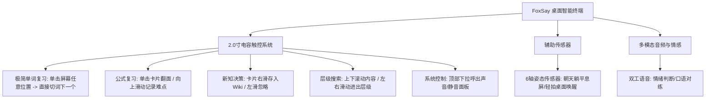

# FoxSay 桌面智能终端硬件设计思考与交互分析 (纯触屏版)

本报告基于您手绘图纸中的核心交互理念，并紧密围绕实战派开发板的 **2.0寸电容式触摸屏** 进行**纯触屏驱动 (Pure Touch-Driven)** 的交互梳理，彻底移除对物理按键复习的依赖，释放触控屏的手势潜力。

---

## 核心定位：触屏驱动的 AI 智能学习桌面伴侣 (Desk Companion)

在 2.0 寸的小屏空间中，手指的**滑、扫、轻触**是最自然、交互阻碍最小的操作。我们重新梳理了闪卡及各模块的交互，建立了一套纯触屏交互体系。

---

## 核心交互模块梳理 (纯触屏设计)

### 1. 闪卡模块：纯触屏低摩擦复习 (Pure Touch Flashcards)
根据单词与公式的学科属性，我们定制了不同的纯触控复习手势：

*   **单词复习（“不要背，看着就行”）**：
    *   **痛点解决**：小屏幕上如果分“认识/不认识”或放小按钮，会增加复习时的心智负担与手指瞄准成本。
    *   **触控手势 ➔ 单击任意位置切词 (Tap anywhere to Next)**：整个屏幕卡片就是一个巨大的热区。用户盯着屏幕看单词，**只需用手指在屏幕任意位置轻轻一戳（单击）**，卡片立刻滑出并滑入下一个单词。不需要做任何对错判断，真正做到“看着就行”的无痛复习流。
*   **数学公式复习（“提示公式，记录难点”）**：
    *   **提示公式 ➔ 单击卡片翻转 (Tap to Flip)**：公式卡片默认只显示主公式。轻触卡片，卡片翻面，显现公式的核心变量释义和提示。
    *   **记录难点 ➔ 向上滑出 (Swipe Up to Log)**：如果是难点公式，用手指**向上滑出**屏幕，卡片向上飞出并闪烁星标，标记为“★ 记难点”。
    *   **下一个 ➔ 向下滑动 (Swipe Down to Next)**：向下滑动切到下一个公式。

### 2. 社区新知推送：卡片划动决策 (Tinder Swipe for Wiki)
*   **手绘初心**：判断推送内容“有没有用，是否放入个人 Wiki”。
*   **触控手势 ➔ 左右划卡 (Swipe Left/Right)**：
    *   采用直观的卡片叠放动效。
    *   **向右扫动卡片** ➔ 卡片飞入右侧，视觉提示“存入 Wiki 📁”，无缝同步进个人课程 Wiki。
    *   **向左扫动卡片** ➔ 卡片飞入左侧，视觉提示“忽略 🗑️”。
    *   极简的指尖一扫，即可完成个人 Wiki 知识库的日常筛选。

### 3. 知识库层级滑动搜索 (Hierarchy Swipe Navigation)
*   **手绘初心**：“层级搜索 ➔ 滑动式的”
*   **触控手势**：
    *   **上下滑动**：滚动轮盘节点（当前选中的词条居中放大，上下词条半透明缩小）。
    *   **向右滑动**：手势向右划（拉出右侧），代表**进入下一层**（例如：微积分 ➔ 极限定义）。
    *   **向左滑动**：手势向左划，代表**退回上一层**。

### 4. 声音与静音快速开关 (Quick Control Panel)
*   **手绘初心**：特别框出的“声音开关”。
*   **触控手势 ➔ 顶部下拉 (Pull Down Menu)**：
    *   在任意页面从屏幕顶部边缘向下滑动，拉出一个半透明的快捷菜单栏。
    *   菜单栏包含：麦克风静音触控按钮、喇叭静音触控按钮、音量滑条。
    *   点击菜单外任意区域，菜单向上收回。完全取代物理拨码开关，方便软件动态接管。

### 5. 情感倾诉与抛弃 (Emotion Overlay)
*   **触控手势 ➔ 全局长按 (Long Press to Invoke)**：在任意界面长按屏幕中央 2 秒，底层高斯模糊，浮现情绪小狐狸与波形。
*   **丢弃手势 ➔ 快速上滑 (Flick Up to Discard)**：吐槽结束后，手指在屏幕上快速向上甩动，语音波形和狐狸化作纸团向上飞出屏幕，界面清空并退回原状态。
